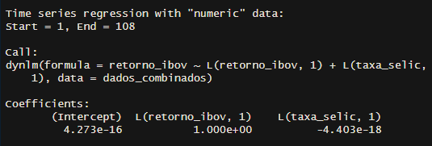
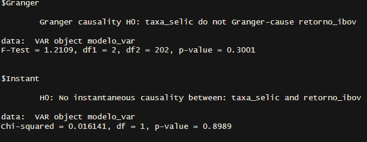
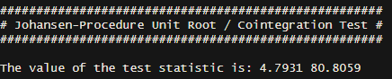
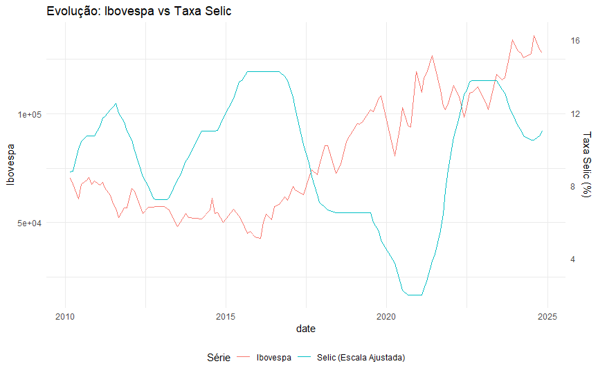
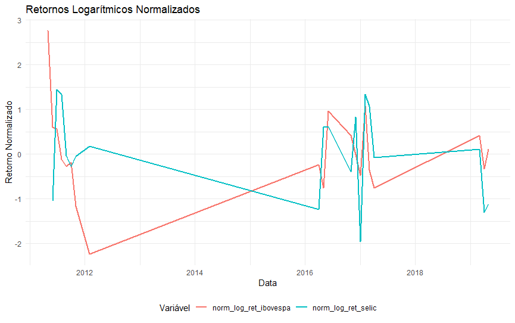
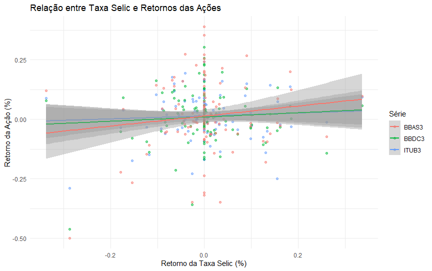
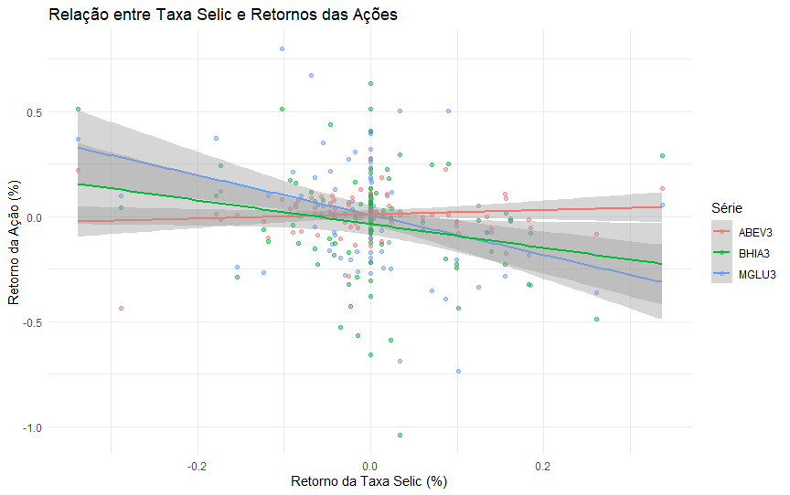

# O impacto da taxa de juros no mercado de ações brasileiro

**Bruno Saraiva Barros**

## **Introdução**

A taxa de juros (SELIC) desempenha um papel central na dinâmica econômica, influenciando decisões de investimento, consumo e poupança. No mercado de ações, variações na taxa de juros impactam tanto as avaliações dos ativos financeiros quanto às expectativas dos investidores. Os juros futuros influenciam todas as ações, pois o valor futuro (fluxo de caixa) gerado por uma empresa é geralmente descontado por uma taxa de juros de longo prazo. Esse desconto representa um prêmio pelo risco que o investidor assume ao optar por ações em vez de renda fixa. O valor justo de uma empresa é calculado pela soma dos fluxos de caixa projetados, e quanto maior a taxa de desconto, menor será o valor presente dessas receitas (Prado, 2024).

Boa parte desta literatura sobre o risco, o retorno e os preços destes ativos baseou-se em variações do Capital Asset Pricing Model (CAPM) e em sua versão intertemporal. Estes modelos sugerem uma relação de compensação entre investimentos de alto risco, como ações, e de baixo risco, como poupança e títulos públicos, onde a escolha entre eles seria baseada em um prêmio pelo risco assumido. Considerando que os ativos de baixo risco são influenciados pela política monetária, especialmente pela taxa básica de juros, as pesquisas apontam, quase unanimemente, para uma relação inversa entre as taxas de juros e os preços das ações (Soares, Firme, Lima, 2021). Já na bolsa brasileira, o comportamento das ações não parece acompanhar a literatura prévia:

No Brasil, a leve correlação negativa entre a taxa básica de juros (SELIC) e o índice de ações da bolsa de valores de São Paulo (IBOVESPA), entre janeiro/2003 e junho/2018, parece corroborar estas hipóteses (i.e., 008). Todavia, ao dividir esta amostra em 3 sub-períodos (i.e., Jan/2003 a Abr/2007; Mai/2007 a Dez/2015; Jan/2016 a Jun/2018) as correlações se tornam fortemente positivas (0,68, 0,58 e 0,53, respectivamente), contrariando a literatura previamente apresentada. Obviamente, estas correlações (Soares, Firme, Lima, 2021, p. 72).

Este relatório tem como objetivo analisar como as mudanças na taxa de juros afetam o mercado de ações no Brasil e se possui uma correlação negativa como em outros mercados, utilizando ferramentas de análise de dados para interpretar relações históricas e identificar padrões relevantes.

A metodologia do trabalho baseou-se na coleta de dados históricos da taxa Selic, obtidos no Banco Central do Brasil, e do Ibovespa, provenientes de fontes como a B3 e o Yahoo Finance, cobrindo o período de janeiro de 2010 a novembro de 2024. Foram realizadas análises estatísticas abrangentes, incluindo correlação entre as variáveis, modelo ARDL para avaliar relações de curto e longo prazo, teste de causalidade de Granger para investigar a influência da Selic sobre os retornos do Ibovespa e o teste de cointegração de Johansen para identificar relações de equilíbrio no longo prazo. Além disso, gráficos de linha e dispersão foram utilizados para explorar padrões e tendências entre as séries temporais.

Os resultados revelaram que a taxa Selic tem um impacto negativo e quase nulo sobre os retornos do Ibovespa no curto prazo, sendo este último mais influenciado por seus retornos passados, característica consistente com um comportamento de "random walk". O teste de causalidade de Granger indicou que não há evidências de que a Selic explique os retornos do Ibovespa de forma significativa no curto prazo. Contudo, o teste de cointegração de Johansen confirmou uma relação de equilíbrio de longo prazo entre a taxa Selic e o Ibovespa, sugerindo que os dois fatores convergem para um alinhamento ao longo do tempo.

A análise também destacou a volatilidade mais pronunciada nos retornos logarítmicos do Ibovespa, especialmente em momentos de choques ou mudanças abruptas. Embora a relação inversa entre a Selic e o Ibovespa seja observada em diversos períodos, ela não é consistente, indicando a influência de outros fatores macroeconômicos. No contexto setorial, o estudo revelou que os bancos apresentam uma correlação positiva fraca com a Selic, com destaque para o Banco do Brasil, enquanto o setor de varejo mostrou maior sensibilidade às variações da taxa de juros, evidenciada por correlações negativas mais significativas.

## **Metodologia**

1.  **Coleta de Dados**:
    -   Dados históricos de janeiro de 2010 até novembro de 2024 da taxa Selic disponibilizados pelo Banco Central do Brasil.
    -   Séries temporais do índice Ibovespa de janeiro de 2010 até novembro de 2024, representando o mercado de ações brasileiro, obtidas a partir de fontes como a B3 e Yfinace.
2.  **Análise Estatística**:
    -   **Aplicação de métodos de correlação** para investigar a relação entre variações na taxa Selic e o desempenho do Ibovespa ações por setor.
    -   **Modelo ARDL** pela sua capacidade de:

-   admitir a possibilidade de cointegração entre variáveis estacionárias e/ou estacionárias na primeira diferença
-   permitir análises de curto e longo prazo (quando há cointegração);
-   controlar o efeito da endogeneidade nos resíduos e obter resultados mais confiáveis em pequenas amostras (Soares, Firme, Lima, 2021).
-   **Análise de causalidade de Granger:** A causalidade, desenvolvida por Granger (1969) testa se uma variável observada durante certo período tem poder explicativo na regressão gerada. Para testar se x causa y, testa-se a hipótese nula de que x não tem causalidade Granger em y (Loiola, 2023).
-   **Teste de cointegração de Johansen:** o teste de cointegração tem por objetivo detectar se entre as variáveis de longo prazo há certo nível de relacionamento. O procedimento dado por Johansen consiste em realizar teste de eficiência de mercado utilizando a cointegração por meio do método de Máxima Verossimilhança. A importância do teste reside, então, na verificação de uma relação de longo prazo entre as variáveis econômicas SELIC e mercado de ações (Loiola,2023).

3.  **Visualização de Dados**:
    -   Uso de gráficos de linhas e dispersão para ilustrar tendências..

## **Resultados**

### **Correlação entre Taxa Selic e Ibovespa**

-   **Modelo ARDL**

O modelo incluiu uma defasagem (lag) tanto para o retorno do Ibovespa quanto para a taxa Selic. A variável dependente é o retorno do Ibovespa.

O coeficiente da taxa selic é praticamente zero e negativo, isso Sugere que a taxa Selic do período anterior tem uma influência extremamente pequena (quase nula) e negativa sobre o retorno do Ibovespa,

O modelo sugere que o Ibovespa tem um comportamento muito próximo ao de um passeio aleatório (random walk), onde o melhor preditor para o valor futuro é o valor atual. A taxa Selic parece ter um impacto estatisticamente insignificante no modelo, sugerindo que outros fatores podem ser mais relevantes para explicar os movimentos do Ibovespa no curto prazo.

-   **Causalidade de Granger**

O teste de causalidade de Granger mostra dois resultados importantes:

1.  H0 (Hipótese nula): A taxa SELIC não causa o retorno do IBOVESPA; Como o p-valor (0.3001) é maior que o nível de significância convencional (0.05), não podemos rejeitar a hipótese nula. Isto significa que não há evidência estatística suficiente para afirmar que a taxa Selic causa os retornos do Ibovespa.
2.  H0: Não há causalidade instantânea entre taxa SELIC e retorno do IBOV; O p-valor alto (0.8989) indica que não há evidência de causalidade instantânea entre as variáveis. Isso sugere que não há uma relação contemporânea significativa entre mudanças na taxa Selic e movimentos no Ibovespa.

Os testes sugerem que as variações na taxa Selic não são bons preditores dos movimentos futuros do Ibovespa no período analisado. Também não há evidência de impacto imediato (mesmo período) da taxa Selic sobre o Ibovespa.

-   **Teste de cointegração de Johansen**

Os resultados sugerem que existe uma relação de longo prazo (cointegração) entre a taxa SELIC e o IBOVESPA. Isto significa que, embora as variáveis possam se mover em direções diferentes no curto prazo (como visto no teste de Granger), elas tendem a manter uma relação de equilíbrio no longo prazo. Esta relação de longo prazo é consistente com a teoria econômica, que sugere que as taxas de juros e o mercado de ações mantêm uma relação de equilíbrio ao longo do tempo.

-   **Evolução SELIC x IBOV**

Em diversos períodos, a Taxa Selic e o Ibovespa apresentam um comportamento inversamente correlacionado. Apesar de haver uma relação inversa em muitos momentos, nem sempre essa relação se mantém. Alguns períodos apresentam desvios, sugerindo a influência de outros fatores macroeconômicos ou externos.

Agora considerando os retornos logarítmicos normalizados, vemos os retornos do Ibovespa mostram maior volatilidade em comparação com os da Taxa Selic, como esperado, dado que o mercado de ações é mais sensível a choques e flutuações do que a taxa de juros, que tende a ser mais estável. Em alguns períodos, especialmente durante choques ou mudanças abruptas (como crises ou alterações na política monetária), os movimentos dos retornos do Ibovespa e da Taxa Selic mostram correlações significativas. Isso reforça a ideia de que mudanças bruscas na taxa de juros afetam os retornos do mercado de ações.

Os períodos de maior desalinhamento sugerem que outros fatores, como crises externas, condições políticas ou eventos globais, também desempenham um papel importante no mercado de ações.

### **Comportamento Setorial**

**fonte: Bancen; Yahoo Finance; Elaboração própria**

No primeiro gráfico temos os maiores bancos em valor de mercado, vemos uma relação positiva bem fraca dos bancos com a SELIC, um pouco maior com o banco do Brasil. A dispersão dos pontos mostra a força da relação, ou seja, uma relação fraca.

Já o segundo gráfico nos é apresentado três maiores empresas do setor de varejo, com duas delas mostrando clara correlação negativa

## **Conclusão**

A análise empírica das relações entre a taxa SELIC e o IBOVESPA revela uma dinâmica complexa entre estas variáveis. No curto prazo, conforme evidenciado pelo modelo ARDL, a influência da taxa SELIC sobre o IBOVESPA mostrou-se estatisticamente insignificante (-4.403e-18), enquanto os retornos passados do próprio índice demonstraram forte persistência (coeficiente próximo a 1), sugerindo que o comportamento recente do mercado tem maior relevância para suas variações imediatas.

Esta ausência de relação significativa no curto prazo é corroborada pelo teste de causalidade de Granger, que não encontrou evidências estatísticas suficientes para afirmar que a taxa SELIC "Granger-causa" os retornos do IBOVESPA (p-valor = 0.3001). Além disso, a ausência de causalidade instantânea (p-valor = 0.8989) sugere que alterações na taxa básica de juros não provocam reações imediatas significativas no mercado acionário.

No entanto, quando analisamos a relação de longo prazo através do teste de cointegração de Johansen, encontramos evidências de uma relação de equilíbrio entre as variáveis. Isto indica que, embora as variações de curto prazo possam não apresentar uma relação clara, existe uma tendência de equilíbrio no longo prazo entre a taxa de juros e o mercado acionário brasileiro.

Estes resultados sugerem que, embora a taxa SELIC seja um importante instrumento de política monetária, sua influência sobre o mercado acionário é mais complexa e possivelmente mediada por outros fatores econômicos. Investidores e analistas devem considerar que, apesar da existência de uma relação de longo prazo, as decisões de investimento no curto prazo podem requerer a análise de um conjunto mais amplo de variáveis além da taxa de juros.

Já no âmbito setorial, o impacto da Taxa Selic varia significativamente conforme o setor e as características específicas de cada empresa. Ao analisarmos o setor bancário, tradicionalmente considerado beneficiário de taxas de juros mais elevadas, encontramos correlações surpreendentemente baixas. Por outro lado, o setor de varejo e consumo apresentou resultados mais expressivos e diferenciados.

Estes resultados indicam que a relação entre taxa de juros e mercado acionário é mais complexa do que geralmente se assume, sendo necessário considerar:

1.  Características específicas de cada setor e empresa
2.  Modelos de negócio e dependência de crédito
3.  Outros fatores macroeconômicos e microeconômicos relevantes

## **Referências**

-   BANCO CENTRAL DO BRASIL. Taxas de juros básicas – Histórico. Disponível em: <https://www.bcb.gov.br/controleinflacao/historicotaxasjuros>. Acesso em: 10 nov. 2024.
-   LOIOLA, Natanael Matos de. O comportamento da taxa de juros no Brasil e seus efeitos no mercado de ações. 2023.
-   PRADO, Maeli. Como juros, inflação e dólar afetam diferentes setores da Bolsa? Bora Investir, 22 nov. 2024. Disponível em: <https://borainvestir.b3.com.br/objetivos-financeiros/investir-melhor/como-juros-inflacao-e-dolar-afetam-diferentes-setores-da-bolsa/>. Acesso em: 03 jan. 2025.
-   SOARES, Luan Wallacy Vieira; FIRME, Vinícius de Azevedo Couto; DE LIMA JÚNIOR, Luiz Antônio. O impacto da política monetária no mercado de ações brasileiro. **Brazilian Review of Finance**, v. 19, n. 1, p. 70-96, 2021..
-   YAHOO FINANCE. Markets: World Indexes, Futures, Bonds, Currencies, Stocks & ETFs. Disponível em: <https://finance.yahoo.com/markets/>. Acesso em: 10 nov. 2024.
